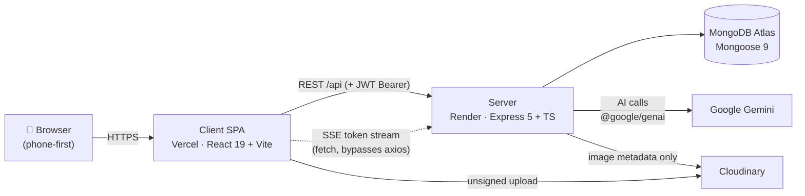

# ARCHITECTURE.md — how the whole system thinks

> Updated 2026-07-11 · verified against source read on this date. The definitive fact-tables (routes, env vars, model fields) live in [`../server/CLAUDE.md`](../server/CLAUDE.md) and [`../client/CLAUDE.md`](../client/CLAUDE.md) — this doc is the *mental model* that ties them together, not a restatement.

If you read only one doc before touching Hot Potato, read this one. It is the map you keep in your head; everything else is a zoom-in.

---

## 1. The shape in one picture

Hot Potato is a **classic two-tier web app**: a React SPA and an Express REST API, plus three managed services. Nothing exotic — the interesting parts are the *rules* (§3), not the topology.



| Half | Repo | Stack | Hosted | Deep docs |
| --- | --- | --- | --- | --- |
| **Client** | `client/` (own git repo) | React 19, TS, Vite 7, Tailwind v4, shadcn/ui, Zustand, TanStack Query, React Router 7, TipTap 3, Fabric 7, KaTeX | Vercel (static SPA) | [`client/CLAUDE.md`](../client/CLAUDE.md) |
| **Server** | `server/` (own git repo) | Node, Express 5, TS, Mongoose 9, JWT, `@google/genai` | Render (free tier) | [`server/CLAUDE.md`](../server/CLAUDE.md) |

> ⚠️ `client/` and `server/` are **two independent git repositories**; the `Hot-Potato/` root is an untracked workspace. Never run git from the root. (See root [`CLAUDE.md`](../CLAUDE.md) §"Git reality".)

They share exactly one contract: **routes defined in `server/src/routes/*` are consumed from `client/src/stores/*` + `client/src/lib`.** Change an endpoint on one side, change the other. That's the whole integration surface.

---

## 2. The request lifecycle (server side)

Every API call walks the same path. Internalize it once and every controller reads the same way.

```
Client (axios) ──▶ app.ts ──▶ route ──▶ auth middleware ──▶ controller ──▶ Mongoose model ──▶ MongoDB
   attaches JWT       mounts       picks     protect /          validates      the data
   Bearer header    all groups   controller  optionalAuth       inline,        contract
                   errorHandler              / restrictTo       responds
                     LAST
```

- **`app.ts` builds and *exports* the Express app** — no `listen`, no DB connect at import time. **`index.ts` boots it** (`dotenv → connectDB → listen`). This split is why the whole HTTP surface is importable by the offline test suite without opening a port. (Details: [`server/CLAUDE.md`](../server/CLAUDE.md) §"Boot split".)
- **The error handler is mounted last** (`app.use(errorHandler)`). It must stay last — the observability ring buffer hooks it. Throw to reach it, or `res.status(...).json(...)` directly (most controllers do the latter).
- **Validation is manual and inline** — no schema-validation library. Controllers are `(req: AuthRequest, res) => Promise<void>` that guard input defensively (`typeof x === "string"` everywhere), respond, and return early. Match that style.
- **Cross-cutting logic lives in `services/`** — anything that isn't a single model: `lessonContext.service` (serialize a lesson for the AI), `tutor/*` (persona/parse/retry/memory), `creator/*` (teacher copilot), `observability.service` (error buffer + AI health), `contentAuthorSnapshot.service` (denormalized author names).

Guard legend you'll see everywhere: **🌐 open** · **🔓 optionalAuth** (works anonymously, richer when logged in) · **🔒 protect** (JWT required) · **👑 admin** (`protect` + role).

---

## 3. The five load-bearing ideas

These are the load-bearing walls. Every one of them is non-obvious, and each has a "what breaks if you violate it." If you internalize nothing else, internalize these.

### ① The TipTap document is the single source of truth
A lesson *is* a stringified TipTap JSON document (`Content.tiptap_json`). **Every block's data — question definitions, canvas drawings, formulas, images — lives in that node's `attrs`,** not in React state, not in a hook, not in a context.
- **Why:** one serialization path means autosave, undo, and the read-only viewer all get everything for free. Fabric canvases sync back into their node attr via a `saveState` bridge; `CanvasContext` is only a *UI pointer* to the active canvas (so the toolbar can reach it without prop-drilling), never a data store.
- **What breaks if violated:** stash canvas/question data in React state and it silently won't be saved — the autosave serializes the TipTap doc, and your data isn't in it. (Deep-dive: [`../client/src/components/README.md`](../client/src/components/README.md), [`ui-structure.md`](ui-structure.md) §editor.)

### ② The server owns lesson context; the client never ships lesson text to the AI
When any AI surface asks a question, the client sends only `{ contentId, blockId, mode, message, ... }`. **The server loads the lesson, serializes it to plain text + a question list (`lessonContext.service.ts`, cached by `updatedAt`), and injects it into the prompt.**
- **Why:** the lesson is trusted server-side data, not user input; keeping it server-side prevents a client from forging lesson context, shrinks payloads, and centralizes the "what does the AI see" logic in one file. The serializer even turns formulas → `[Formula] latex`, videos → `[Video] src`, drawings → a placeholder, tables → piped rows, so the tutor "sees" non-text blocks.
- **What breaks if violated:** re-introduce client-sent lesson text and you re-open prompt-injection + trust holes, and the two sides drift. (Full prompt build: [`../asking-flow.md`](../asking-flow.md).)

### ③ Anonymous = full access; login = persistence only (Golden Rule 2)
No-login users read every public lesson **and** use the AI tutor in full. The *only* difference when logged out: nothing persists.
- **How it's enforced:** AI and public-read routes use **`optionalAuth`, never `protect`.** Logged-in users get server-side `ChatSession` history + `StudentMemory`; anonymous users pass their recent thread (`clientThread`) with each request and lose it on tab close — by design.
- **What breaks if violated:** adding `protect` to an AI or public-content read path is a **product regression**, not a security upgrade. `/settings` and `/status` are public pages too. (Guard placement is a security *decision* — see [`ideas.md`](ideas.md) ADR-004.)

### ④ Never ration tokens for real students (Golden Rule 1)
No per-student quotas, no message caps, no "daily limit" UI, no paywall. Rate limiting exists **only** to stop bots, with env-tunable thresholds so generous no human hits them (`AI_RATELIMIT_PER_10MIN=60`, `AI_RATELIMIT_PER_DAY=1000`), and limiters are **per-surface** (the teacher copilot has its own bucket, so teacher AI never eats the student budget).
- **What breaks if violated:** any "usage limit" logic on the student path contradicts the product's reason to exist (students far from good schools).

### ⑤ AI writes into the doc only via preview → accept
The teacher copilot (`/api/creator/assist`) can draft sections, generate questions, propose formulas — but **nothing enters the document until the teacher accepts a preview,** and then only as a normal editor transaction (autosave/optimistic-concurrency untouched). The AI **never emits raw TipTap JSON**: prose comes back as markdown, question blocks as typed JSON that's validated server-side (malformed items dropped).
- **What breaks if violated:** auto-applying AI output, or trusting raw model JSON as document nodes, corrupts lessons and bypasses the one human checkpoint that keeps teacher content trustworthy. (Flow: [`data-flow.md`](data-flow.md) §teacher copilot.)

---

## 4. Where things live (module maps → the source of truth)

Don't memorize file trees — know *which map to open*. These maps already exist and stay current in the `CLAUDE.md` files; this doc just tells you they're there.

| You're looking for… | Open |
| --- | --- |
| The full route table (every endpoint + guard) | [`server/CLAUDE.md`](../server/CLAUDE.md) §"API surface" |
| The data contract (9 Mongoose models, fields) | `server/src/models/*.model.ts` (truth) · summary in [`data-model.md`](data-model.md) |
| The AI prompt build, module by module | [`../asking-flow.md`](../asking-flow.md) + `server/src/services/tutor/*` |
| The page map + route guards | [`ui-structure.md`](ui-structure.md) · `client/src/App.tsx` |
| Global client state (the ~15 stores) | [`ui-state.md`](ui-state.md) · `client/src/stores/*` |
| The lesson editor internals | [`../client/src/components/README.md`](../client/src/components/README.md) |
| The single client→AI bridge | `client/src/components/editor/extensions/tutorApi.ts` |
| The single client→teacher-copilot bridge | `client/src/lib/creatorApi.ts` |

---

## 5. The realities that shape the UX (latency & durability)

These aren't bugs — they're the free-tier physics the code is written around. Know them before you diagnose "it's broken."

- **Render cold-starts.** The server sleeps on the free tier; the first request after idle takes several seconds *on top of* AI latency. Every `/chat/*` and content-load path shows a loading state. **Slow ≠ down.** (`useColdStartHint` on the client nudges the user during long waits.)
- **Transient-error retry is load-bearing.** `generateWithRetry` (`services/tutor/retry.ts`) retries transient network failures because the owner's ISP drops connections. It is not optional polish — never delete or bypass it; Tier-1 observability hooks its outcomes.
- **Observability is in-memory and wiped on restart.** The error ring buffer + AI-health snapshot on `GET /api/status/all` reset every time Render restarts (which is often). That's accepted — the Status page labels it "since last restart." It stores **route + code + error name only**, never messages or request bodies (and names are admin-gated). No paid monitoring SaaS — it's a solo free-tier project.
- **SSE streaming deliberately bypasses axios.** Token streaming uses raw `fetch` (`callTutorStream`), not the axios instance, and falls back to the JSON path if the stream fails *before the first token* (never mid-stream). Route-splitting and interceptors must not break this path.

---

## 6. The two data planes (a useful way to think about it)

It helps to see Hot Potato as two overlapping planes over the same models:

- **The authoring plane** (teacher): `Content` is created blank → edited in the TipTap editor with autosave + optimistic concurrency → published with an `access_type` and per-lesson `agent_settings`. The teacher copilot assists but never auto-writes.
- **The learning plane** (student): a `Content` is read (viewer serializes the same TipTap doc) → the student answers questions (`UserContent.answers`, keyed by block id) → and converses with the tutor, which is grounded in the *authoring plane's* lesson text + guide answers + `agent_settings`. Better teacher content ⇒ better tutor context. That coupling is the product's core loop.

Persistence differs by plane and by auth:

| | Logged in | Anonymous |
| --- | --- | --- |
| Lesson content | `Content` (server) | read-only; can't author |
| Answers | `UserContent.answers` (server, autosynced) | client store only (lost on tab close) |
| Tutor history | `ChatSession` per (user, content, block) | `clientThread` sent per request |
| Tutor memory | `StudentMemory` (updated async) | none |

---

*Next: [`data-flow.md`](data-flow.md) turns these ideas into concrete step-by-step sequences (save, answer, auth, AI). [`ideas.md`](ideas.md) records **why** each load-bearing idea was chosen and what alternatives were rejected.*
