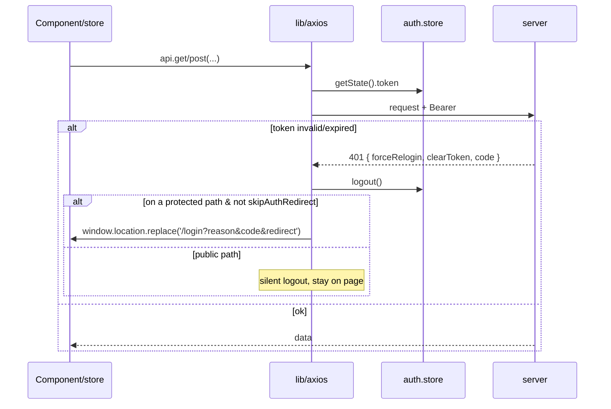
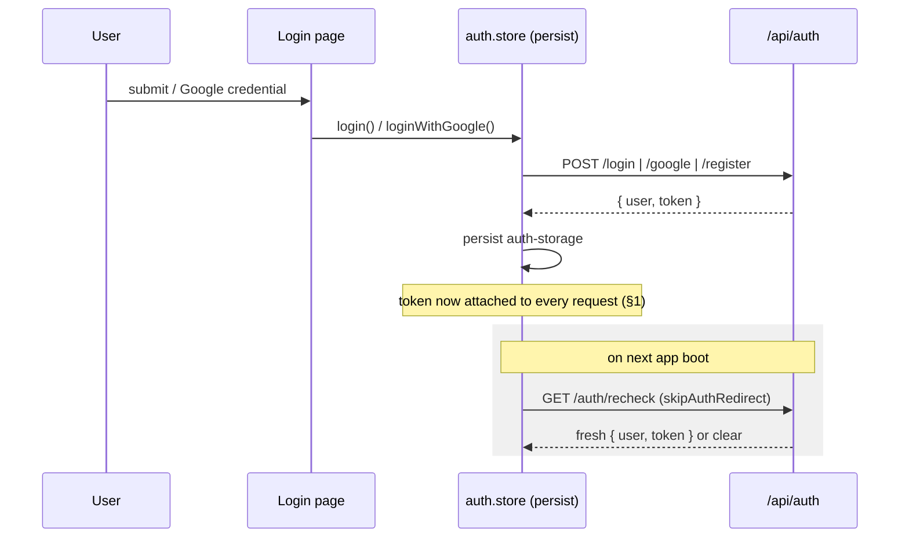
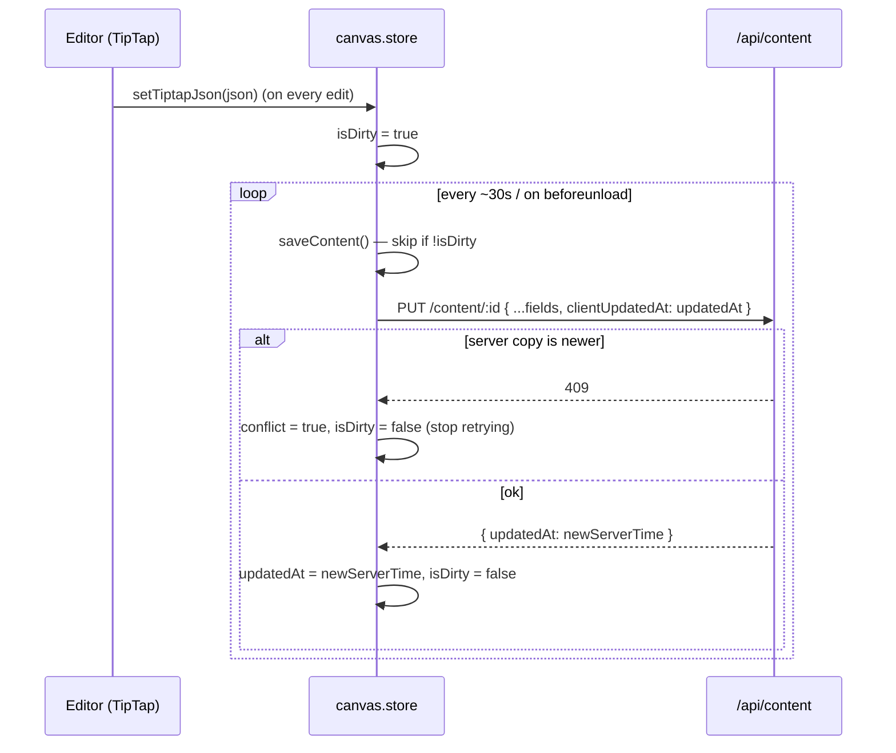
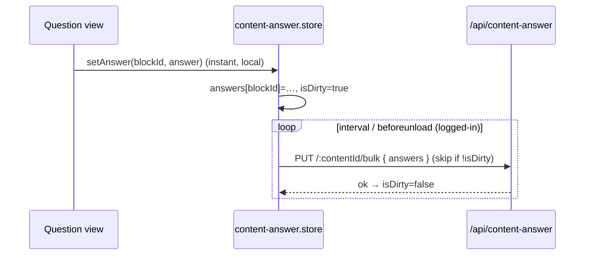
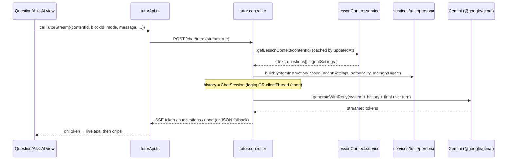
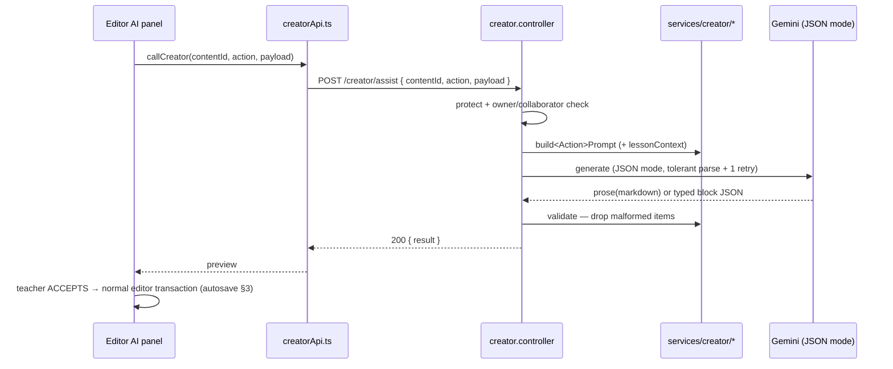

# data-flow.md — the end-to-end flows

> Updated 2026-07-11 · verified against `canvas.store.ts`, `content-answer.store.ts`, `auth.store.ts`, `lib/axios.ts`, `lessonContext.service.ts`, and the tutor controller/services. The AI *prompt build* has its own deep doc — [`../asking-flow.md`](../asking-flow.md); this doc is the *cross-half sequences*.

Six flows carry the whole product. Each section: **the trigger → the ordered steps → a sequence diagram → persistence → the sharp edges.** Read the one you're about to touch.

Files that own the flows: `client/src/stores/*` (state + API calls), `client/src/lib/axios.ts` (transport + 401), `client/src/components/editor/extensions/tutorApi.ts` (AI bridge), `client/src/lib/creatorApi.ts` (copilot bridge), `server/src/controllers/*`, `server/src/services/*`.

---

## 1. Transport: how *any* request goes out (and how a dead session logs you out)

Before any specific flow: **every** call rides one axios instance (`lib/axios.ts`). Understand it once.

- **Request interceptor** reads the JWT from `auth.store` *outside React* (`useAuthStore.getState().token`) and sets `Authorization: Bearer <token>`. This is why you must never read the token from React state for API calls — one source of truth, no drift.
- **Response interceptor** watches for the server's **structured 401** (`forceRelogin === true || clearToken === true`). On it: `logout()` (clears user+token), then — **only if** the current path is a *protected* path and we're not already on `/login` and the caller didn't pass `skipAuthRedirect` — `window.location.replace(buildForcedLoginUrl(...))` carrying `reason`, `code`, and a `redirect` back-target. Public pages just get logged out silently (no redirect), preserving Golden Rule 2.

**Sharp edges:** the 401 body shape is a **two-sided contract** — `auth.middleware.ts` (server) must emit exactly `{ forceRelogin, clearToken, code }` and `axios.ts` (client) parses exactly that. Change one, change both. `recheckToken` passes `skipAuthRedirect: true` so a stale token on boot clears quietly. `isProtectedPath` is a hard-coded prefix list (`/dashboard`, `/canvas`, `/uploadimage`, `/history`, `/create`, `/profile`, `/change-password`) — add a protected route, add it here.

---

## 2. Auth & session

**Trigger:** login / register / Google sign-in, or app boot with a persisted token.

- `auth.store` holds `user` + `token`, **persisted to localStorage** as `auth-storage` (only those two fields; `partialize`). `login`/`register`/`loginWithGoogle` all POST and set `{ user, token }`.
- **Google:** the GIS button yields a signed `credential` (an ID token) → `POST /auth/google` → server verifies signature+audience (`google-auth-library`, audience = `GOOGLE_CLIENT_ID`) → find-or-create / auto-link by verified email → same `{ user, token }` shape.
- **On mount** (`App.tsx`) a persisted token triggers **one** `recheckToken()` (guarded by a ref because it mints a fresh JWT) → `GET /auth/recheck` → refresh `user` (sliding session); on failure it nulls user+token quietly.

**Persistence:** token+user in localStorage; the server is stateless (JWT). **Sharp edges:** roles — `admin` gates diagnostics; `creator`/`learner` are cosmetic today (any logged-in user can author). Registration always yields `learner`; promote via `npm run promote`. Blocked/suspended accounts: `protect` returns structured 401 `ACCOUNT_INACTIVE`, but `optionalAuth` just degrades them to anonymous (Golden Rule 2).

---

## 3. Lesson lifecycle: create → edit (autosave) → publish → view

**The most-broken area for newcomers** — the autosave + optimistic-concurrency dance plus **① TipTap = source of truth.**

### Create
`Dashboard`/`Create` → `content.store.createContent()` → `POST /content/create` (blank) → returns `content_id` → navigate to `/canvas/:id`.

### Edit + autosave (the core loop)
The editor state lives in **`canvas.store`**: `title`, `tiptapJson`, `agentSettings`, `accessType`, `updatedAt`, `isDirty`, `conflict`. Every setter (`setTiptapJson`, `setTitle`, …) marks `isDirty: true`. A timer in `TipTapCanvas.tsx` calls `saveContent()` on an interval (~30 s) + on `beforeunload`.

- **Optimistic concurrency:** `saveContent()` sends the `updatedAt` it last knew as `clientUpdatedAt`. If the DB copy is newer (edited elsewhere), the server returns **409**; the store sets `conflict: true` and clears `isDirty` so `beforeunload` won't keep retrying a doomed save. `forceSave()` re-PUTs **without** `clientUpdatedAt` to intentionally overwrite.
- **Publish** = the same `PUT` with `access_type`, `topics`, `description`, and `agent_settings` (set from the Publish modal). There is no separate publish endpoint.

### View (read-only)
`/view/:id` → `canvas.store.loadContent()` → `GET /content/load?id=` (🔓 optionalAuth, enforces `access_type`) → `TiptapViewer` renders the **same `tiptap_json`** read-only. On a private lesson while logged out, load fails → `contentLoadError` shown (no crash).

**Persistence:** the lesson is `Content.tiptap_json` (server). **Sharp edges:** anything not written into a node attr isn't saved (**idea ①**); denormalized `author_name`/`collaborator_names` are recomputed server-side and client values ignored; the viewer's CSS `zoom` is separate from the app font-size (**ADR-007/008**).

---

## 4. Student answers

**Trigger:** a student answers a question block.

- `content-answer.store` mirrors `UserContent.answers` — a `Record<blockId, any>`. `setAnswer(blockId, answer)` updates **locally only** (`isDirty = true`) for instant UX; `syncAnswers()` flushes the whole map via `PUT /content-answer/:contentId/bulk`.
- `loadAnswers(contentId)` hydrates on lesson open. Syncing happens on an interval + before unload — **logged-in only** (anonymous answers live in the store and vanish on tab close, by design).

**Sharp edges:** the answer map is keyed by **block id** — changing a question node's id shape breaks saved student work. The store is currently *global* (not scoped per `contentId`); a known caveat in [`../notes.md`](../notes.md) is that anonymous answers can leak across lessons — scope it when you touch this. Feedback (the AI part) is a **separate** call (§5), not part of answer persistence.

---

## 5. The AI tutor call (student side)

**Trigger:** first submit on a question card, a follow-up thread turn, or the Ask-AI modal/block. **The single bridge is `tutorApi.ts`** (`callTutor` / `callTutorStream`) → `POST /api/chat/tutor` (🔓 optionalAuth). *This section is the cross-half sequence; the exact prompt assembly is [`../asking-flow.md`](../asking-flow.md).*

The client sends only `{ contentId, blockId, mode, message, questionContext?, clientThread, personality, currentSection? }` — **never lesson text.** For feedback modes the client also computes the deterministic `evaluation` (level/accuracy/diagnostics) via `questionEvaluation.ts` and passes it in `questionContext`.

- **Mode picks the shape** (see **mode** in the glossary): `question_feedback`/`write_evaluation` wrap the turn in an evaluation task tag; `free_chat`/`followup` pass the message through raw — which is why small talk in a thread isn't graded.
- **Model routing:** `question_feedback` + `quick_check` → fast model; everything else → tutor model (`resolveTutorModel`, defaults in `services/tutor/models.ts`).
- **Streaming:** `callTutorStream` uses raw `fetch` (not axios) for SSE and falls back to `callTutor` (JSON) if the stream dies *before the first token*. `parseTutorReply` splits `[SUGGESTIONS]` → chips and strips internal tags/labels before display.

**Persistence:** logged-in → `ChatSession` per (user, content, block) + async `StudentMemory` update every N turns; anonymous → nothing server-side (context carried in `clientThread`). **Sharp edges:** never add `protect` here (Golden Rule 2); never delete `generateWithRetry`; the `[SUGGESTIONS]` format spans three files.

---

## 6. Teacher copilot (`/api/creator/assist`)

**Trigger:** a teacher uses any AI tool in the editor (generate questions, draft section, proofread, formula, critic, publish autofill). **Single bridge: `lib/creatorApi.ts`** (`callCreator(contentId, action, payload)`, plain axios JSON, no SSE) → `POST /api/creator/assist` (🔒 protect + owner/collaborator check + own rate-limit bucket).

**The two invariants (idea ⑤):** (1) **preview → accept** — AI output enters the doc only after the teacher accepts, as a normal editor transaction (autosave/409 untouched); (2) **never raw TipTap JSON** — prose returns as markdown (inserted via tiptap-markdown), question blocks as typed JSON validated server-side. **Sharp edges:** never swap the guards to `optionalAuth` (this is the *one* teacher-only AI surface); the copilot has its own rate-limit bucket so it never eats the student budget.

---

## Cross-flow persistence summary

| Data | Logged in | Anonymous | Owner (client) |
| --- | --- | --- | --- |
| Auth token/user | localStorage `auth-storage` | — | `auth.store` |
| Lesson content | `Content` (server) | read-only | `canvas.store` |
| Student answers | `UserContent.answers` (autosync) | store only, ephemeral | `content-answer.store` |
| Tutor history | `ChatSession` (50-msg cap) | `clientThread` per request | — |
| Tutor memory | `StudentMemory` (async) | none | `tutorMemory.store` (view/erase) |
| Personality | `StudentMemory.tutor_personality` | localStorage | `tutorPersonality.store` |

*See [`ui-state.md`](ui-state.md) for the full store map and persistence boundaries, and [`data-model.md`](data-model.md) for the server entities these flows write to.*
