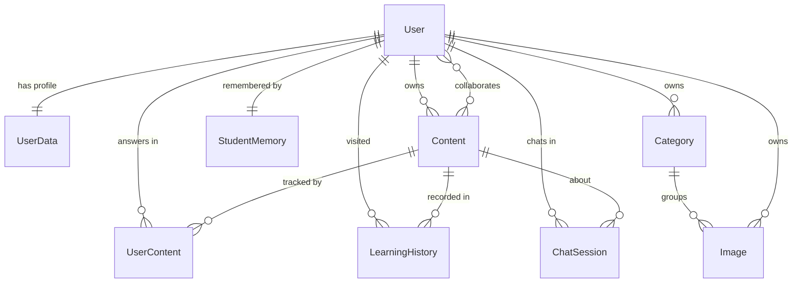

# data-model.md — the 9 entities and how they live

> Updated 2026-07-11 · **The `.model.ts` files are the source of truth**; this doc is the mental model over them. The field-level table is in [`../server/CLAUDE.md`](../server/CLAUDE.md) §"Data model". ⚠️ `server/src/models/schema.md` is **stale** — ignore it, use this + the models.

Nine Mongoose models. Two are the spine (`User`, `Content`); the rest hang off the **(user, content)** pair or off the user. Mongoose `timestamps` add `createdAt`/`updatedAt` unless a model overrides the names (a couple use `created_at` only).

---

## 1. The relationships

Read it as: **a `User` owns many `Content`; each `(User, Content)` pair spawns a `UserContent` (answers) and a `LearningHistory` (recency); tutor chats are `ChatSession` per (user, content, block); each user has one `StudentMemory` and their own `Category`→`Image` library.**

The **(user, content) join is the busiest concept** — three models key off it (UserContent, LearningHistory, ChatSession), each with a unique compound index.

---

## 2. Each entity's lifecycle (born → mutated → capped → deleted)

### User — the account
- **Born:** `POST /auth/register` (always `role: learner`) or `POST /auth/google` (find-or-create, passwordless). `password` is **optional** (Google-only accounts have `googleId` instead; unique+sparse).
- **Mutated:** profile edits (`PUT /users/me/profile`) — a display-name change **propagates** to denormalized author snapshots on all their lessons. Password auto-hashed (bcrypt cost 12) in a `pre("save")` hook.
- **Roles:** `admin | creator | learner`; only `admin` gates anything today (diagnostics). Promote via `npm run promote`.
- **Deleted:** no delete-account flow yet (deferred — ROADMAP Tier 6.A).

### UserData — optional profile extension
Avatar / bio / flexible `metadata` (Mixed). One per user. Separate from `User` so the account doc stays lean.

### Content — the lesson (the other spine)
- **Born:** `POST /content/create` — blank, `tiptap_json: "{}"`, `access_type: private`, owner = creator.
- **Mutated:** editor autosave `PUT /content/:id` with **optimistic concurrency** (`clientUpdatedAt` → 409 on stale). Carries `tiptap_json` (the whole lesson document, stringified), `agent_settings` (per-lesson tutor controls), `access_type`, `topics`, `description`, and **denormalized** `author_name`/`collaborator_names` (recomputed server-side, client values ignored).
- **Read:** `GET /content/load` (access enforced) + `GET /content/search` (mine / public explore). Also serialized for the AI by `lessonContext.service` (cached by `updatedAt`).
- **Deleted:** `DELETE /content/:id` (owner only). *No cascade today* — orphaned UserContent/ChatSession/etc. are tolerated.

### UserContent — the answer/progress tracker
- One row per **(user, content)** (unique compound index). Holds `answers: Map<blockId, any>` + `last_visited`.
- **Born/mutated:** `PUT /content-answer/:id` (single) or `/bulk` (whole map). **Logged-in only** — anonymous answers never reach here.
- **Sharp edge:** the map is keyed by **block id**; changing a question node's id shape breaks saved student work.

### LearningHistory — "recently opened"
One row per (user, content); `last_accessed`. Updated via `touchLearningHistory()` on visit. Indexed `(user_id, last_accessed desc)` for the History page.

### ChatSession — tutor conversation
- One per **(user, content, block)** (unique compound). `messages[]`, **capped at 50** by a pre-save hook.
- **Logged-in only.** Anonymous users have no session — they send `clientThread` per request instead (Golden Rule 2). This is the single biggest logged-in vs anonymous divergence.

### StudentMemory — the tutor's sketch of a student
- **One per user** (unique). `interests / strengths / growth_areas / preferences / recent_topics` (≤10 items each, ≤120 chars) + `tutor_personality` (the selected preset id).
- **Mutated async:** the fast model distills recent turns every `AI_MEMORY_EVERY_N_TURNS` (default 3) student messages (`services/tutor/memory.ts`); injected into the tutor prompt as a digest.
- **Controlled by the student:** viewable + erasable at `/profile` (`GET/DELETE /chat/memory`). Anonymous users have no row.

### Category & Image — the Cloudinary image library
- `Category`: a folder, unique per `(user_id, name)`, `created_at` only.
- `Image`: Cloudinary metadata (`public_id` unique, `secure_url`, dimensions, `bytes`, …), optional `category_id`. Both scoped per user. All routes 🔒 protect.

---

## 3. Reading the data model correctly (gotchas)

- **`schema.md` is stale** — it predates several models/fields. Trust `*.model.ts`; this doc explains them.
- **Access control lives in controllers, not schemas.** Owner/collaborator checks are inline in `content.controller` / `tutor.controller` / `history.controller` (a candidate for a shared `checkContentAccess` helper — see [`../notes.md`](../notes.md)).
- **Denormalization is deliberate.** `author_name`/`collaborator_names` are copies for cheap list rendering; kept in sync by `contentAuthorSnapshot.service`. Don't "fix" them by joining.
- **`tiptap_json` is an opaque string to the server** except when `lessonContext.service` parses it for the AI. The server never validates lesson structure — the client (TipTap) owns that.
- **No cascade deletes.** Deleting a `Content` or (future) `User` leaves dependent rows; a real delete-account flow (Tier 6.A) must cascade UserData, UserContent, ChatSession, StudentMemory, LearningHistory, images.

*Next: [`ideas.md`](ideas.md) records **why** the model is shaped this way (denormalization, the (user,content) join, logged-in vs anonymous split).*
