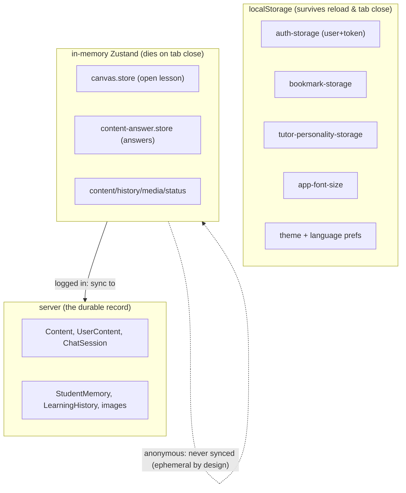

# ui-state.md — frontend state & data flow

> Updated 2026-07-11 · verified against `client/src/stores/*` and `lib/axios.ts`. The per-store responsibility table also lives in [`../client/CLAUDE.md`](../client/CLAUDE.md); this doc adds the *mental model* — how the stores group, what persists where, and the token flow.

State lives in **~15 Zustand stores** (`src/stores/*.store.ts`), each a plain `create()` store; a few use the `persist` middleware (localStorage). TanStack Query is available for server-state caching but usage is partial — **match whatever the page you're editing already does** (store-driven vs query-driven). There is no Redux, no global context for data (only `CanvasContext`, a UI pointer).

**The one rule that prevents the classic bug:** the auth token has exactly one home — `auth.store` — and `lib/axios.ts` reads it *outside React* (`getState().token`). **Never** read the token from a component and pass it to an API call; you'll get drift. (Transport details: [`data-flow.md`](data-flow.md) §1.)

---

## 1. The stores, grouped by job

Think in five groups, not fifteen files:

### Identity
| Store | Holds | Persist |
| --- | --- | --- |
| `auth.store` | `user` + `token`; `login`/`register`/`loginWithGoogle`/`recheckToken`/`logout` | ✅ `auth-storage` (only user+token, via `partialize`) |
| `profile.store` | Account profile (`GET/PUT /users/me/profile`); syncs `auth.store` on name change | — |

### The current lesson (editor working set)
| Store | Holds | Persist |
| --- | --- | --- |
| `canvas.store` | The lesson being edited/viewed: `title`, `tiptapJson`, `agentSettings`, `accessType`, `topics`, `description`, `updatedAt`, `isDirty`, `conflict`; `loadContent`/`saveContent`/`forceSave` | — |
| `content-answer.store` | The student's answer map for the open lesson (`answers[blockId]`, `isDirty`); `setAnswer` (local) → `syncAnswers` (bulk) | — |

`canvas.store` is the single source of the editor's non-document metadata and owns the **autosave + 409** logic; the *document itself* is the TipTap JSON string inside it. See [`data-flow.md`](data-flow.md) §3–4.

### Lists & discovery
| Store | Holds | Persist |
| --- | --- | --- |
| `content.store` | Lesson lists: `contents` (mine) + `exploreContents`; create/search/delete | — |
| `learningHistory.store` | Recently visited lessons | — |
| `bookmark.store` | Device-local lesson bookmarks | ✅ `bookmark-storage` |

### Media
| Store | Holds | Persist |
| --- | --- | --- |
| `cloudinary.store` | Image upload / library state | — |
| `category.store` | Image-library folders | — |

### Tutor prefs, memory & app chrome
| Store | Holds | Persist |
| --- | --- | --- |
| `tutorPersonality.store` | Selected tutor preset id; auto-attached to every `/chat/tutor` call | ✅ `tutor-personality-storage` |
| `tutorMemory.store` | The student's tutor-memory sketch (`GET/DELETE /chat/memory`); strips internal fields | — |
| `theme.store` | Light/dark theme | ✅ device pref |
| `language.store` | UI language (Thai/English); also sets `document.documentElement.lang` | ✅ device pref |
| `appearance.store` | App-wide font size; applies `%` to `<html>` at module load (imported in `main.tsx`) | ✅ `app-font-size` |
| `status.store` | System-status page data | — |

---

## 2. Persistence boundaries (the important mental model)

Where a piece of state *survives* is the thing newcomers get wrong. Three tiers:

- **localStorage** = device preferences + the session token. Small, non-sensitive-ish (the JWT is here — standard for this app's threat model).
- **In-memory stores** = the working set for the current SPA session. `canvas.store` and `content-answer.store` hold the live lesson/answers and **flush to the server on an interval + `beforeunload` — only when logged in.**
- **Server** = the durable truth. **Anonymous users never sync** — their answers and chat context live only in memory / `clientThread` and vanish on tab close. That's Golden Rule 2 working as designed, not a bug.

---

## 3. Store ↔ API map (which store owns which endpoints)

Every store that talks to the server does so through the shared `api` (axios). Quick index:

| Store | Endpoints |
| --- | --- |
| `auth.store` | `POST /auth/login \| /register \| /google`, `GET /auth/recheck` |
| `profile.store` | `GET/PUT /users/me/profile` |
| `canvas.store` | `GET /content/load`, `PUT /content/:id` (save + forceSave) |
| `content.store` | `POST /content/create`, `GET /content/search`, `DELETE /content/:id` |
| `content-answer.store` | `GET /content-answer/:id`, `PUT /content-answer/:id/bulk` |
| `learningHistory.store` | `GET /history`, `POST /history/visit/:id` |
| `category.store` / `cloudinary.store` | `/categories/*`, `/images/*` |
| `tutorMemory.store` | `GET/DELETE /chat/memory` |
| `status.store` | `GET /status/all` |

**Not through a store:** the two AI bridges — `tutorApi.ts` (`/chat/tutor`) and `creatorApi.ts` (`/creator/assist`) — are called directly from editor/viewer components, because they're per-interaction (and `callTutorStream` uses raw `fetch` for SSE, bypassing axios). Full contract for the endpoints: [`../server/CLAUDE.md`](../server/CLAUDE.md).

---

## 4. Patterns to copy (and traps to avoid)

- **Adding a store:** plain `create<State>()`; opt into `persist` only for device prefs or the token (with `partialize` to keep it minimal — see `auth.store`). Name it `*.store.ts`.
- **Error state:** most stores keep a local `error` string set on catch. Note ([`../notes.md`](../notes.md)) that a few stores share one `error` field across unrelated flows (e.g. `content.store` dashboard vs explore) — scope errors when you touch them.
- **Instant-then-sync:** the answer store's pattern — mutate locally for instant UX (`setAnswer`), flush the whole thing later (`syncAnswers`) — is the template for anything that needs to feel fast but persist eventually.
- **Don't duplicate the token source** (§ intro). Don't stash editor/canvas data in a store expecting persistence — the *document* is the TipTap JSON in `canvas.store.tiptapJson`; block data must be in node attrs (**idea ①**).
- **Font size ≠ viewer zoom.** `appearance.store` (inline `%` on `<html>`) and the viewer's CSS `zoom` are separate mechanisms — never merge them ([`ideas.md`](ideas.md) ADR-008).

*Next: [`data-model.md`](data-model.md) for the server entities these stores read/write, and [`ideas.md`](ideas.md) for why the state is shaped this way.*
