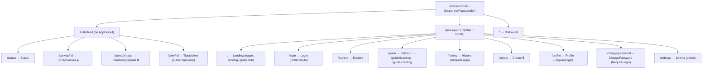

# ui-structure.md — the frontend skeleton

> Updated 2026-07-11 · verified against `client/src/App.tsx`, the route guards, `AppLayout`, and the editor component tree. Field-level route notes stay in [`../client/CLAUDE.md`](../client/CLAUDE.md) §"Routing"; this doc is the *shape* — what wraps what, and how the editor is built.

The client is a **single-page app** (`vercel.json` rewrites everything to `index.html`). One `<BrowserRouter>` in `App.tsx`, three guard components, one shared layout, and — at the center of gravity — the TipTap editor. Get this shape in your head and any page is findable.

---

## 1. The route tree (verified from `App.tsx`)

Two structural facts drive everything:

- **Almost every page is `React.lazy`** inside one `<Suspense fallback={<PageLoader/>}>`. Only `Landing` and `NotFound` are eager. Heavy vendor libs (TipTap/Fabric/KaTeX) are pinned to separate chunks so Landing/Explore/Login never download the editor. (Why: [`ideas.md`](ideas.md) ADR-014.)
- **Three routes render *outside* the shared `AppLayout`** (full-bleed): `/status`, `/canvas/:id`, `/uploadimage`, and `/view/:id`. Everything else renders inside it.



Full route table with per-page notes: [`../client/CLAUDE.md`](../client/CLAUDE.md). The 🔒 marks `ProtectedRoute`.

---

## 2. The three route guards (in `components/`)

Guarding is **declarative in `App.tsx`**, never scattered `if (!user)` checks inside pages. Pick the right one:

| Guard | Behavior | Use for | Anonymous sees |
| --- | --- | --- | --- |
| **`ProtectedRoute`** | Hard gate — redirects to `/login` with `state.from` for redirect-back | Owner-only tools (`/dashboard`, `/canvas/:id`, `/create`, `/uploadimage`) | a redirect to login |
| **`RequireLogin`** | Soft gate — renders an inline "please sign in" prompt (takes `title`/`description` props), no redirect | Personal pages that should still render chrome (`/history`, `/profile`, `/change-password`) | a friendly inline prompt |
| **`PublicRoute`** | Inverse — bounces *authenticated* users away (to `redirect` param or `/explore`) | `/login` | the page |

`/view/:id`, `/explore`, `/settings`, `/status` have **no guard** — they're public by design (Golden Rule 2). The API behind them uses `optionalAuth`, so logged-out works everywhere.

---

## 3. `AppLayout` — the shared chrome

`layouts/AppLayout.tsx` = `<TopNav/>` + `<Outlet/>`. It's the only place nav chrome lives. `TopNav` shows different items for logged-in vs anonymous (`authOnlyNavItems` vs `publicNavItems`); its first item is "หน้าแรก" → `/`. The full-bleed routes skip it precisely because the editor, viewer, upload tool, and status page each own their whole screen.

---

## 4. The lesson editor — the heart of the UI

`/canvas/:id` → `TipTapCanvas` page → `TipTapEditor.tsx` (`components/editor/`). This is where 60% of the client's complexity lives. The mental model (deep-dive: [`../client/src/components/README.md`](../client/src/components/README.md)):

**Layout shell** (`TipTapEditor` defines it):

```
┌─ Top bar ──────────────────────────────── TipTap state only (title, save, zoom) ┐
├─ Left sidebar ─┬─ Main area ──────────────────────────┬─ Right sidebar ─────────┤
│ TipTap toolbar │  the TipTap document (the lesson)    │ TipTap toolbar          │
│ + Fabric tools │  — nodes render here                 │ + Fabric/canvas props   │
│ + AI hub (5th) │                                      │                         │
└────────────────┴──────────────────────────────────────┴─────────────────────────┘
```

- **Two editable objects, two wiring styles.** The **TipTap editor** is passed to the toolbar via props. The **Fabric canvas** is reached via `CanvasContext` — a *UI pointer* to the currently-active canvas (not a data store), so the toolbar reaches it without prop-drilling. (Why: **idea ①**.)
- **Node registry:** `config/editorExtensions.ts` → `createEditorExtensions(editable)`. Standard nodes (StarterKit, Link, Table, Youtube, Markdown, TextAlign…) + **custom nodes**:

| Custom node | File pattern | What it is |
| --- | --- | --- |
| `ResizableImage` | `extensions/ResizableImage.ts` | Resizable images |
| `FabricCanvasNode` | `extensions/FabricCanvasNode.ts` + `FabricCanvasView` | Embedded Fabric drawing/design canvas |
| `FormulaBlockNode` | `editor/FormulaBlock/` | Visual math builder → `latex` attr → KaTeX |
| **5 question nodes** | `extensions/Question*.ts` + `*View.tsx` | The critical-thinking blocks (below) |

- **Question node pattern:** each is a `*Node.ts` (TipTap schema + attrs, incl. the stable `id`) paired with a `*View.tsx` (React render, both creator + viewer modes). The five: `QuestionChoice`, `QuestionWrite`, `QuestionBlankChoice`, `QuestionBlankWrite`, `QuestionAgent` (embedded Ask-AI). See the glossary.
- **The teacher AI hub** (`components/editor/ai/`): a 5th left-sidebar category "AI" leading the rail, plus header entries. Every tool is a card that opens a dialog (`AiQuestionDialog`, `AiDraftDialog`, `WritingPreviewDialog`, `AiCriticDialog`, `AiFormulaPanel`). All go through `lib/creatorApi.ts` and the **preview → accept** rule (idea ⑤). This whole subtree stays inside the lazy editor chunk.

**Two toolbar performance notes you'll trip on:** toolbar items are `memo()`'d, and `dynamicUpdate` (static mode) forces re-render on editor changes; **zoom** is a CSS `zoom` on the card container (not `transform: scale`). Both explained in [`../client/src/components/README.md`](../client/src/components/README.md) and [`ideas.md`](ideas.md).

---

## 5. The lesson viewer (student read-only)

`/view/:id` → `TiptapView` page → `TiptapViewer.tsx` + `FabricCanvasReadOnly.tsx`. It renders the **same `tiptap_json`** the editor produced, read-only (`createEditorExtensions(false)`). Extra student surfaces layered on top:

- Each question node's `*View.tsx` renders its **viewer mode** with the answer input + `FeedbackDiscussionPanel` (the thread) + `SuggestionChips`.
- A floating **Ask-AI modal** (FAB) sends `free_chat` with the pseudo-block `"__lesson_ai_assistant__"` + a `currentSection` reading-position hint.
- Tutor replies render through `MarkdownMessage.tsx` (strict markdown allowlist; raw HTML skipped).

**In the viewer, the window is the only vertical scroller** — `.editor-main` never overflows (this is why `zoom` beat `transform: scale`, which reintroduced a double scrollbar).

---

## 6. Component & folder organization (for orientation)

```
client/src/
├── App.tsx            # the route tree + guards (§1)
├── main.tsx           # React root; imports appearance.store (font size) so it runs every route
├── layouts/           # AppLayout
├── pages/             # one component per route (+ pages/guide/* showcases)
├── components/
│   ├── ui/            # shadcn/ui primitives (don't hand-edit; compose with cn())
│   ├── editor/        # the editor (§4): extensions/, ai/, FormulaBlock/, config/
│   └── *.tsx          # TopNav, ContentCard, the 3 guards, ThemeToggle, TutorMemoryCard, …
├── stores/            # Zustand global state → see ui-state.md
├── hooks/             # useFabric, useFabricSetup, useCanvasDrag, useColdStartHint
├── contexts/          # CanvasContext (UI pointer to active Fabric canvas)
├── lib/               # axios, creatorApi, cloudinary, i18n, format, utils, contact
└── types/             # shared TS types
```

Conventions that matter: **`@` alias → `src/`** (mandatory, no deep relative imports); pages `PascalCase.tsx`, stores `*.store.ts`, hooks `useX.ts`; Tailwind v4 is **CSS-first** (no `tailwind.config.js`); UI copy is bilingual via `useAppI18n`. Full convention list: [`../client/CLAUDE.md`](../client/CLAUDE.md).

*Next: [`ui-state.md`](ui-state.md) — the state behind these screens (the ~15 stores, what persists, the axios/token flow).*
